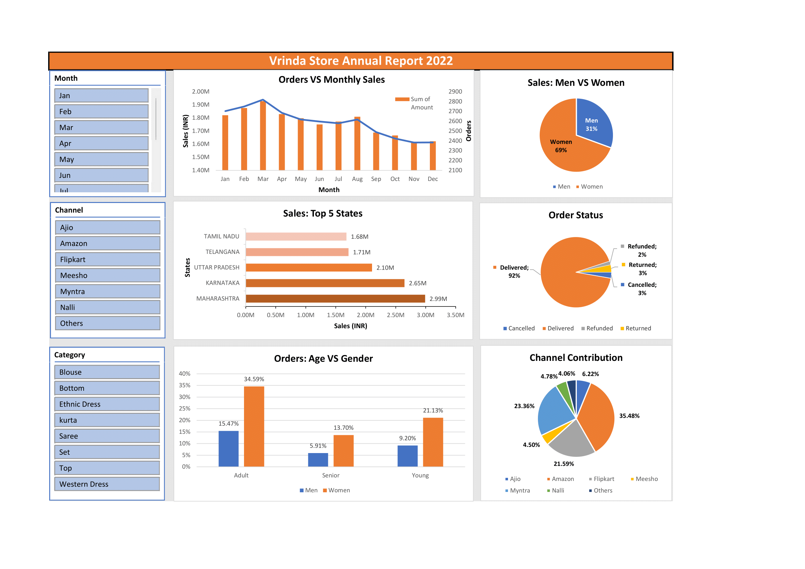

# Vrinda-Store-Analysis-On-Excel
_Vrinda Store wants to create an annual sales report for 2022. So that, Vrinda can understand their customers and grow more sales in 2023._

## Author
- [@saadharoon27](https://github.com/saadharoon27)

## Table of Contents
- [Business Problem](#business-problem)
- [Data Source](#vrinda-store-dataset)
- [Business Questions](#business-questions)
- [Method](#method)
- [Quick Glance At The Dashboard](#quick-glance-at-the-dashboard)
- [Step By Step Procedure](#step-by-step-procedure)
- [Business Insights](#business-insights)
- [Business Suggestion](#business-suggestion)

## Business Problem
Vrinda Store is gearing up to compile a comprehensive annual sales report for the year 2022. This report is envisioned as a crucial tool for Vrinda's business strategy moving forward, with the primary goal of gaining valuable insights into their customer base. By analyzing the data from the past year, Vrinda aims to identify trends, patterns, and customer preferences that will enable them to make informed decisions and devise targeted marketing strategies for the upcoming year, 2023.

## Data Source
- [Vrinda Store Dataset](https://www.kaggle.com/datasets/harunshah786/vrinda-store-dataset)

## Business Questions
These questions collectively aim to provide a comprehensive understanding of the sales and order data for 2022, enabling data-driven decision-making and strategy development for Vrinda Store's growth and improvement in 2023.

- 1.	Compare the sales and orders using a single chart.
- 2.	Which month got the highest sales and orders?
- 3.	Who purchased more? Men or women in 2022?
- 4.	What are the different order statuses in 2022?
- 5.	List the top 5 stats contributing to the sales.
- 6.	Relation between age and gender based on number of orders.
- 7.	Which channel has the maximum contribution?

## Method
- Exploratory data analysis _(EDA)_

## Quick Glance At The Dashboard

## Steps By Step Procedure

- **Data Cleaning**
  - **Gender column:** Replaced the categorical value _‘M’_ and _‘W’_ values to _‘Men’_ and _‘Women’_.
  - **Quantity column:** Replaced the values _‘One’_ and _‘Two’_ to _‘1’_ and _‘2’_ respectively.

- **Data Processing**
  - **Age Group:** To address the *question vi* Of business question, a new column has to be created named **‘Age Group’** to extract the relationship between _‘Age’_, _‘Gender’_, and the _number of orders_ they made. 
  - **Categories:** >=50, Senior; >=30 and <50, Adult; <30, Young
  - **Month Column:** To address *question ii*, a **‘Month’** column has been created.

- **Analysis & Dashboarding**
  - **Step 1:**
    - To address _questions i_ and _ii_, created a new pivot table in sheet **‘Q1 - Order vs Sales Chart’** comparing total monthly sales value and the number of orders.
  - **Step 2:**
    - Created a new sheet, **‘Q3 – Most Purchases’** to analyse which gender purchased the most, addressing _question iii_.
  - **Step 3:**
    - Created a new sheet, **‘Q4 – Order Status’** to address _question iv_, which checks the status of the order compared to the total orders.
  - **Step 4:**
    - To address _question v_, a new pivot table has been made in the sheet named: **‘Q5 – Top 5 States’**.
  - **Step 5:**
    - To understand the relationship between _age, gender,_ and _number of orders,_ and to address _question vi_ a new sheet has been created named: **‘Q6 – Age, Gender, Orders’**.
  - **Step 6:**
    - Addressing _question vii_: To check which channel has the highest contribution a pivot chart has been created in sheet: **‘Q7 – Channels’**.

- **Filters**
  - To create an interactive visual dashboard, **3 slicers** were made on: *Month, Channel,* and *Category.*

## Business Insights
  - 1.	Orders and sales revenue are on **decrease** since _March_.
  - 2.	March has the highest sales **(~INR 1.92M)** and order volumes **(2819)**.
  - 3.	_Women_ are more likely to buy compared to _men_ **(~65%)**.
  - 4.	The majority of the orders were delivered **(92%)**.
  - 5.	_Maharashtra, Karnataka,_ and _Uttar Pradesh_ are the **top 3** **states (~35%).**
  - 6.	The adult age group **(30 – 49 yrs)** has a maximum contribution **(~50%)**.
  - 7.	_Amazon, Flipkart,_ and _Myntra_ channels have maximum contribution **(~80%)**.

## Business Suggestion
- Target women customers of the age group (30 — 49 years) living in Maharashtra, Karnataka, and Uttar Pradesh by showing ads/offers/coupons available on Amazon, Flipkart, and Myntra.
